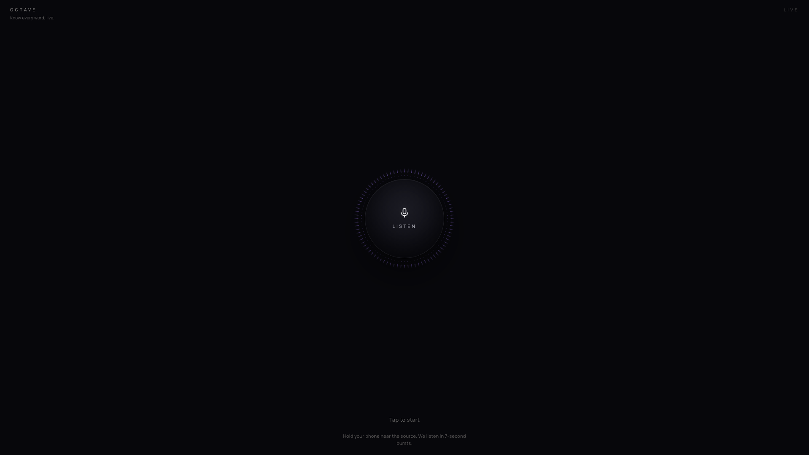
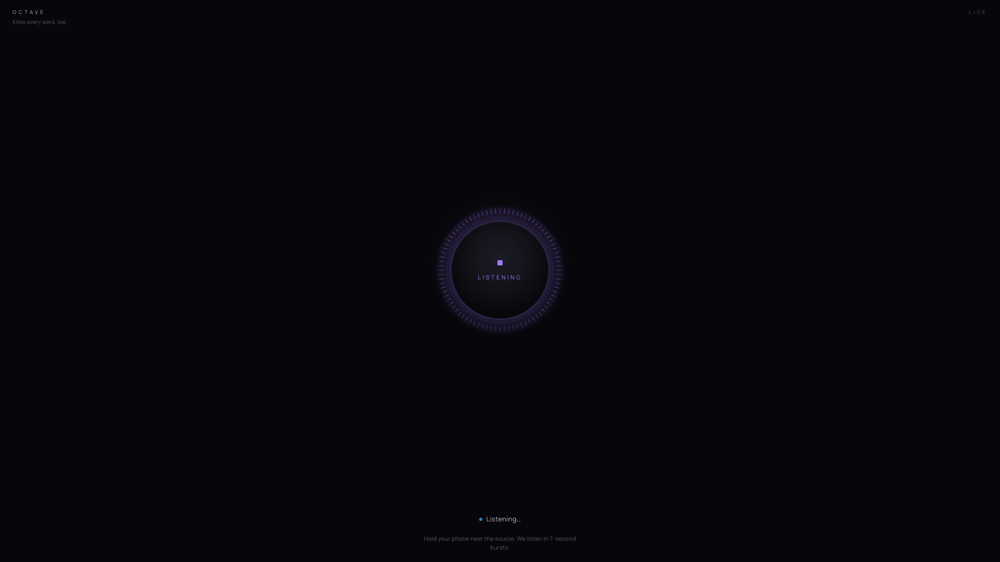
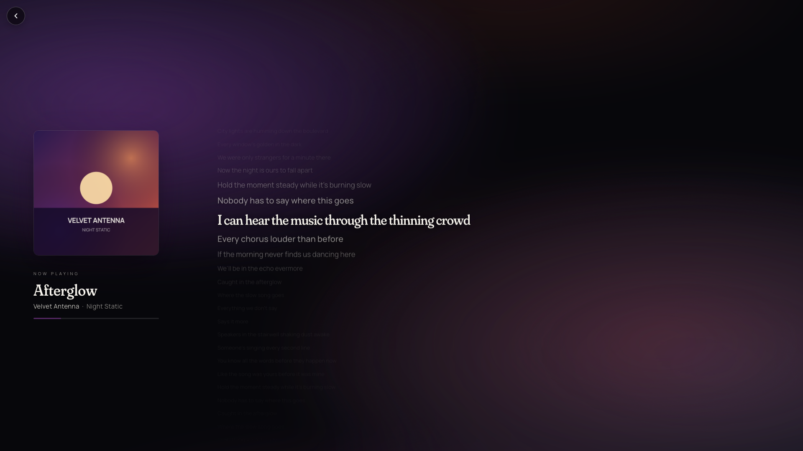

# Octave

> Know every word, live.

Octave is a phone-first music recognition app that listens to nearby audio, identifies the song, and opens a synced lyric view aligned to the exact point currently playing. It is built as a React/Vite frontend with a FastAPI backend that proxies ACRCloud, LRCLIB, Spotify oEmbed, and an optional local Whisper fallback.

## Demo

<p align="center">
  <video src="media/octave-demo.mp4" controls muted poster="media/octave-now-playing.png"></video>
</p>

<p align="center">
  <a href="media/octave-demo.mp4">Watch the demo video</a>
</p>

| Idle | Listening | Synced lyrics |
| --- | --- | --- |
|  |  |  |

## Why it is interesting

- **Real audio pipeline:** the browser records 7-second WAV clips from the mic, downsamples them to 16 kHz mono, and sends them to a Python API for recognition.
- **Drift-corrected lyric sync:** the frontend seeds its lyric clock with ACRCloud's `play_offset_sec` plus measured request/render latency, then re-identifies every 30 seconds to correct drift.
- **Confidence-aware matching:** high-confidence matches still get a second-position validation, while borderline matches require corroboration before the app commits to a song.
- **Phone-first interaction:** the UI is tuned for the real use case: holding a phone near concert speakers or a nearby sound source.
- **Secure API boundary:** ACRCloud signing, LRCLIB lookup, Spotify cover resolution, and Whisper fallback all run server-side. Secrets never ship to the browser.

## How it works

1. **Mic capture:** `useAudioCapture` asks for microphone access from a user tap, creates a Web Audio graph, and records 7-second clips through a persistent `ScriptProcessor` subscriber fan-out. The same source feeds an `AnalyserNode` for the live radial visualizer.
2. **Song identification:** the FastAPI backend signs each request with HMAC-SHA1 and forwards the WAV to ACRCloud's Identification API. Low-score matches are rejected at the API boundary.
3. **Lyric lookup:** the backend queries LRCLIB by title, artist, album, and duration, preferring synced LRC data and falling back to search when `/get` is too strict or only returns plain lyrics.
4. **Clock correction:** when a match commits, the frontend adds elapsed pipeline time to `play_offset_sec` before starting the lyric clock, covering recognition latency, lyric lookup latency, and React render time.
5. **Ongoing re-identification:** while lyrics are playing, Octave samples again every 30 seconds. Corrections within a 3.5-second tolerance are accepted; large jumps are ignored as likely chorus-confusion matches.
6. **Whisper fallback:** after repeated ACR misses, the backend lazy-loads `openai-whisper`, transcribes the latest clip locally, turns the transcript into short candidate queries, and searches LRCLIB.
7. **Adaptive visuals:** once a song is found, the frontend samples the album cover on a tiny canvas and uses the dominant palette to tint the backdrop, active lyric glow, and progress bar.

## Tech stack

**Frontend:** React 18, Vite 5, Tailwind CSS, Web Audio API, Canvas, Fraunces, Manrope.

**Backend:** FastAPI, Uvicorn, Pydantic, Requests, HTTPX, `python-dotenv`, optional `openai-whisper`.

**External services:** ACRCloud Identification API, LRCLIB, Spotify oEmbed.

## Run locally

Requires Python 3.10+, Node 18+, and ACRCloud Identification API credentials.

```bash
# 1. Clone
git clone https://github.com/<your-username>/octave.git
cd octave

# 2. Backend
cd backend
python3 -m venv .venv
source .venv/bin/activate
pip install -r requirements.txt
cp .env.example .env
# Fill in ACR_HOST, ACR_ACCESS_KEY, and ACR_SECRET_KEY in backend/.env
uvicorn main:app --reload

# 3. Frontend, in a second terminal
cd frontend
npm install
npm run dev
```

Open `http://localhost:5173`, allow microphone access, tap **Listen**, and play a song nearby.

No ACRCloud keys yet? Run the frontend and open `http://localhost:5173/?demo`. Demo mode loads the now-playing view with canned song data, generated album art, and synced placeholder lyrics. It does not need a backend, mic access, or API credentials.

If the default backend port is busy, start the API on another port and point Vite at it:

```bash
cd backend
uvicorn main:app --reload --port 8001

cd ../frontend
OCTAVE_API_PORT=8001 npm run dev -- --port 5174
```

For phone testing on the same Wi-Fi network, use HTTPS through a tunnel such as ngrok, Cloudflare Tunnel, or Tailscale Serve. Browsers only grant microphone access on `localhost` or secure origins.

## Verification

```bash
cd frontend
npm test
npm run build

cd ..
python3 -m py_compile backend/main.py backend/acr.py backend/whisper_fallback.py backend/test_acr.py
```

To verify ACRCloud credentials with a real clip:

```bash
cd backend
python test_acr.py path/to/clip.wav
```

## Project structure

```text
backend/
  main.py               FastAPI routes, LRCLIB lookup, Whisper fallback endpoint
  acr.py                ACRCloud signing, matching, Spotify cover lookup
  whisper_fallback.py   Lazy-loaded local Whisper transcription
  test_acr.py           Manual ACRCloud credential smoke test

frontend/
  src/App.jsx                  Listen/playback state machine
  src/hooks/useAudioCapture.js  Mic capture, WAV encoding, analyser fan-out
  src/hooks/useLyricsSync.js    Playback clock and active lyric index
  src/components/              Listen button, now-playing view, lyrics display
  src/utils/                   LRC parser, palette extraction, demo data
```

## What I learned

The hardest part was making synced lyrics feel reliable. ACRCloud returns where the captured audio sits in the track, but the user sees the lyric view after recognition, lyric lookup, and React rendering have already taken time. Adding that measured elapsed time to the clock seed fixed the line-level drift, and periodic re-identification keeps longer sessions aligned without accepting obvious repeated-chorus jumps.

I also learned that music metadata APIs fail in practical ways: precise lyric lookups can miss because an album name or duration differs, fingerprinting can return the right song at the wrong repeated section, and lyric search is title/artist-oriented rather than phrase-oriented. Most of Octave's complexity exists to make those edge cases invisible during a live listen.

## Origin

I built Octave after spending hours at concerts enjoying opening sets but missing most of the lyrics. The idea was simple: if a phone can identify the song, it should also be able to put the current words on screen in real time. This project turned that moment into a working end-to-end app.
